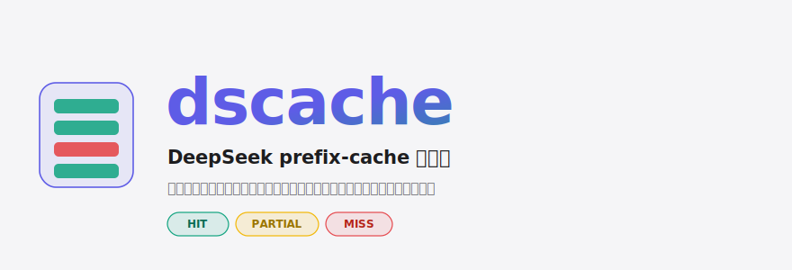
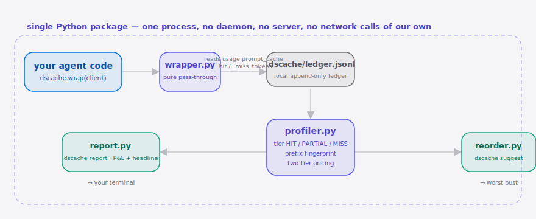
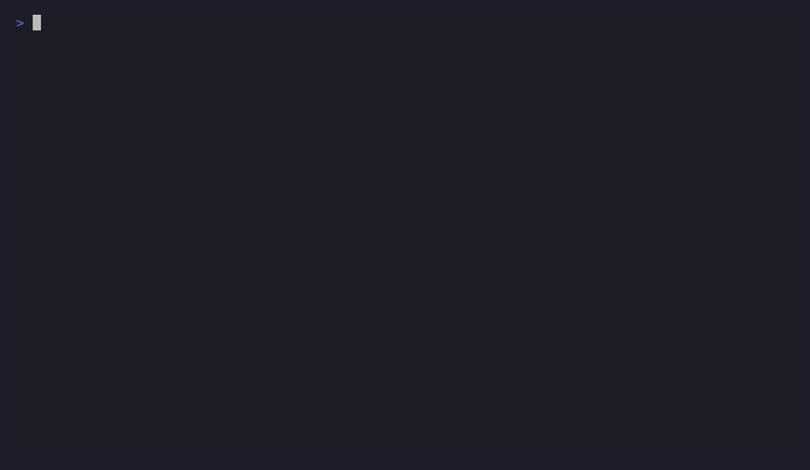

<div align="right">

[English](./README.en.md) | **简体中文**

</div>

<p align="center">
  <picture>
    <source media="(prefers-color-scheme: dark)" srcset="./assets/hero-dark.svg">
    <source media="(prefers-color-scheme: light)" srcset="./assets/hero-light.svg">
    
  </picture>
</p>

<p align="center"><sub>给你的 DeepSeek <b>Agent</b> 装一张 prefix-cache 利润表，把被打爆的上下文缓存折扣稳稳拿回来。</sub></p>

<p align="center">
  <a href="./LICENSE"></a>
  
  <a href="https://github.com/SuperMarioYL/dscache/actions/workflows/ci.yml"></a>
  
  
  
</p>

> **你的 DeepSeek Agent 每跑一轮循环都在偷偷多花钱——一次 prompt 前缀被打乱，整段上下文缓存折扣就从命中价掉回原价，而你的工具里没有任何东西会告诉你。dscache 用两行代码把这件事变成一张能看、能算、能修的利润表。**

<h2> 架构</h2>

<p align="center">
  <picture>
    <source media="(prefers-color-scheme: dark)" srcset="./assets/atlas-dark.svg">
    <source media="(prefers-color-scheme: light)" srcset="./assets/atlas-light.svg">
    
  </picture>
</p>

单一 Python 包，单进程——无守护进程、无服务端、无我们自己的网络调用。数据流向：你的代码 → `wrapper`（纯透传，读 `prompt_cache_hit/miss_tokens`）→ `.dscache/ledger.jsonl` → `profiler`（定档 + 前缀指纹 + 两档计价）→（`report` 打利润表 | `reorder` 给重排建议）→ 终端。

## 目录

- [为什么需要它](#为什么需要它)
- [安装与快速开始](#安装与快速开始)
- [用法](#用法)
- [演示](#演示)
- [对比 DeepSeek-Reasonix](#对比-deepseek-reasonix)
- [配置](#配置)
- [付费 / 团队版](#付费--团队版)
- [路线图](#路线图)
- [许可证与贡献](#许可证与贡献)

## 为什么需要它

通用的 LLM 成本看板（Helicone / Langfuse）按 OpenAI 的计价语义统计 token，**完全没有 DeepSeek 两档（命中价 / 原价）上下文缓存定价的概念**，所以它们既看不出某次请求有没有落进便宜的命中价档，也无法检测到「前缀被打爆」那一刻。而打爆缓存的成本恰恰发生在 Agent 循环里：同一段长前缀被复用几百次，一个被注入的时间戳、一次被重排的工具列表，就足以让你从折扣价悄悄掉回原价。dscache 读 DeepSeek 的 `prompt_cache_hit_tokens` / `prompt_cache_miss_tokens`，把这笔看不见的、反复发生的超支变成一条可度量、可控制的账目。

## 安装与快速开始

三条命令，从克隆到看见第一张利润表：

```bash
pip install dscache              # < 20s
dscache demo                     # 写入一份样例账本（无需 API key）并打印利润表
dscache suggest                  # 看最严重的一次打爆 + 重排建议
```

接入你自己的代码，只改两行：

```python
import dscache
from openai import OpenAI

client = dscache.wrap(OpenAI(base_url="https://api.deepseek.com", api_key="sk-..."))
# 照常跑你的 Agent 循环——dscache 透明记录每次响应的缓存用量到 .dscache/ledger.jsonl
```

跑完后在终端执行 `dscache report` 即可。

<details>
<summary>样例输出</summary>

```
                    dscache — prefix-cache profit & loss
┏━━━┳━━━━━━━━━━━━━━━━━━━┳━━━━━━┳━━━━━━━━┳━━━━━━━━┳━━━━━━┳━━━━━━━━━┳━━━━━━━━━┓
┃ # ┃ request           ┃ tier ┃ prompt ┃ cached ┃ miss ┃    cost ┃  wasted ┃
┡━━━╇━━━━━━━━━━━━━━━━━━━╇━━━━━━╇━━━━━━━━╇━━━━━━━━╇━━━━━━╇━━━━━━━━━╇━━━━━━━━━┩
│ 1 │ chatcmpl-demo-000 │ HIT  │   4200 │   4120 │   80 │ ¥0.0022 │       — │
│ 4 │ chatcmpl-demo-003 │ MISS │   4200 │    120 │ 4080 │ ¥0.0082 │ ¥0.0061 │
└───┴───────────────────┴──────┴────────┴────────┴──────┴─────────┴─────────┘
╭────────────────────────────────── headline ──────────────────────────────────╮
│ This run busted the cache 1× and cost 1.53× what it should — ¥0.0067 wasted. │
╰──────────────────────────────────────────────────────────────────────────────╯
```

</details>

<h2> 用法</h2>

三个命令，对应三种工作流。完整脚本见 [`examples/`](./examples/quickstart.py)。

```bash
# 1) 看每次请求落在哪一档，以及这一轮一共浪费了多少钱
dscache report

# 2) 拿到最严重那次打爆的「前缀重排建议」（建议，绝不自动改写你的请求）
dscache suggest

# 3) 指定账本路径（默认 .dscache/ledger.jsonl）
dscache report --ledger ./traces/run-42.jsonl
```

库 API（两行接入）：

```python
client = dscache.wrap(your_deepseek_client)          # 透明代理，原样返回响应
entries = dscache.profile(dscache.load_ledger(path)) # 也可以直接拿到结构化账目
```

<h2> 演示</h2>

完整的演示脚本见 [`docs/demo.tape`](./docs/demo.tape)（vhs 脚本，CI 会在打 tag 时渲染成 `assets/demo.gif`）。



> GIF 由 `.github/workflows/demo.yml` 在首个 `v*` tag 时自动渲染并提交。

## 对比 DeepSeek-Reasonix

[esengine/DeepSeek-Reasonix](https://github.com/esengine/DeepSeek-Reasonix)（23k★）把 prefix-cache 稳定性写进了一个具体的编码 Agent 里——这恰好证明了痛点真实。但它把稳定性逻辑**焊死在一个产品内部**，不是一个能挂到你自己管线上的可复用度量/优化原语。诚实地说，在「就让它一直跑」这件事上 Reasonix 体验更完整；dscache 补的是另一个位置：可复用、可嵌入、看得见每一次打爆。

| 能力轴 | dscache | DeepSeek-Reasonix |
| --- | :---: | :---: |
| 逐请求 缓存命中/打爆 度量 | ✓ | — |
| 两档（命中价/原价）计价与浪费金额 | ✓ | — |
| 可挂到任意 DeepSeek 客户端（两行接入） | ✓ | — |
| 开箱即用的完整编码 Agent 体验 | — | ✓ |
| 前缀稳定性默认内建 | 建议，不自动改写 | ✓（焊死在产品里） |

## 配置

v0.1 **无需配置文件**，也不需要除你已有 DeepSeek key 之外的任何 key。可调项通过命令行参数给出：

| 选项 | 类型 | 默认值 | 含义 |
| --- | --- | --- | --- |
| `--ledger` / `-l` | path | `.dscache/ledger.jsonl` | 账本（JSONL）文件路径 |
| `--requests` / `-n` | int | `8` | `dscache demo` 写入的样例请求数 |

## 付费 / 团队版

v0.1 的 OSS 库**永久免费**，且**没有任何 v0.1 功能被付费墙挡住**。

面向已经在为 DeepSeek 账单买单的小团队（3–10 人共享编码 Agent），我们提供一个**托管团队版**：开发者上传本地 `ledger.jsonl` 轨迹，服务端跨团队聚合缓存折扣节省、画出趋势曲线，并在**命中率回退时告警**（例如「本周团队 HIT 率掉了 18%——某次 prompt 模板改动打爆了缓存」）。它就是这张本地利润表的「上线 + 持久化 + 监控」版本。

- **价格**：**¥39 / 席位 / 月**（约 $5.50），团队最低 3 席 → 入门约 ¥117/月；年付送 2 个月。
- **最短「掏卡」路径**：`dscache report --upload` → 打印团队看板分享链接 → 14 天免费试用 → 试用结束后回退告警邮件里附一个两步 Stripe / 支付宝结账。无销售电话。

定价刻意压在这张利润表能演示出来的「省下的 ¥」之下，所以它自证其值。

## 路线图

- [x] **m1 · 包装与定档** — `dscache.wrap()` 透传记录账本；`dscache report` 打印逐请求 HIT/PARTIAL/MISS 表 + 两档计价。
- [x] **m2 · 重排建议** — `profiler` 计算前缀指纹、标记打爆事件；`dscache suggest` 给出能恢复稳定缓存段的具体重排。
- [x] **m3 · 金钱头条** — 汇总 `cost_actual − cost_ideal`，产出一句可分享的「打爆 N×，多花 X.Y 倍，浪费 ¥Z」。
- [x] **v0.2.0 · 诚实化** — 利润表只统计 DeepSeek 真正上报缓存拆分的请求（UNKNOWN 档不再伪造「浪费 ¥」）；采样头纳入 `tools`/`tool_choice`，重排打爆现在能被看见；打爆归因到「最近一次命中」而非紧邻的上一条；新增段级归因（`tools[3]` / `messages[0..2]`），明确只解释客户端自身的前缀偏移，无法观测 DeepSeek 服务端的全局 LRU 淘汰。
- [ ] 托管团队版（上传聚合 + 回退告警，见上）。
- [ ] 跨模型支持（Kimi / Qwen / GLM，post-v0.1）。

## 许可证与贡献

[MIT](./LICENSE) 授权。欢迎提 issue 描述你某次真实被打爆的账单数字，或直接发 PR——尤其是新的两档计价校准与重排策略。

## Share this

```
dscache — DeepSeek Agent 的 prefix-cache 利润表：两行代码看清每次请求是命中还是被打爆，
再给一条能直接套用的重排建议，把上下文缓存折扣拿回来。 https://github.com/SuperMarioYL/dscache
```

> 推送后建议设置仓库 topics：`gh repo edit --add-topic deepseek --add-topic agent --add-topic prefix-cache`

<p align="center"><sub><a href="./LICENSE">MIT</a> © 2026 SuperMarioYL</sub></p>
