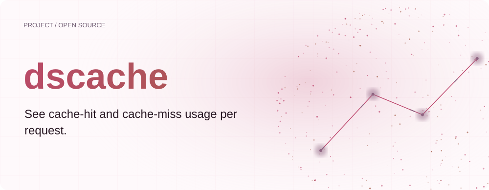
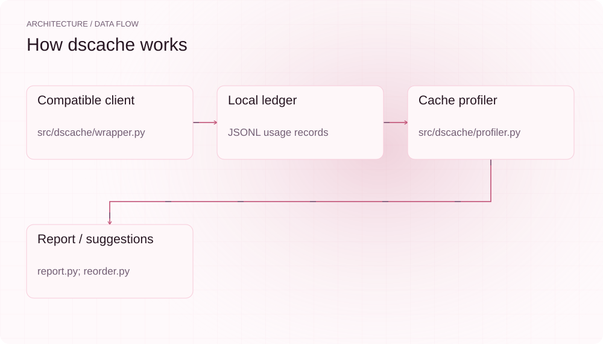
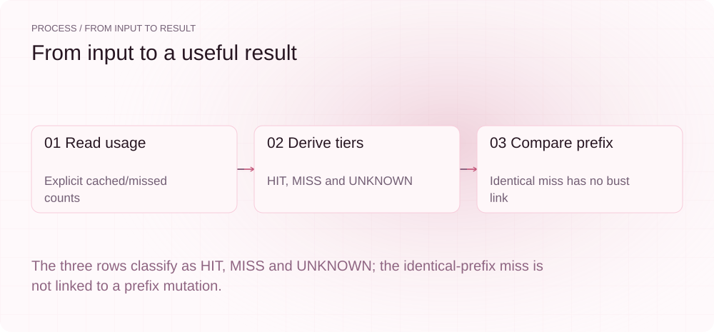
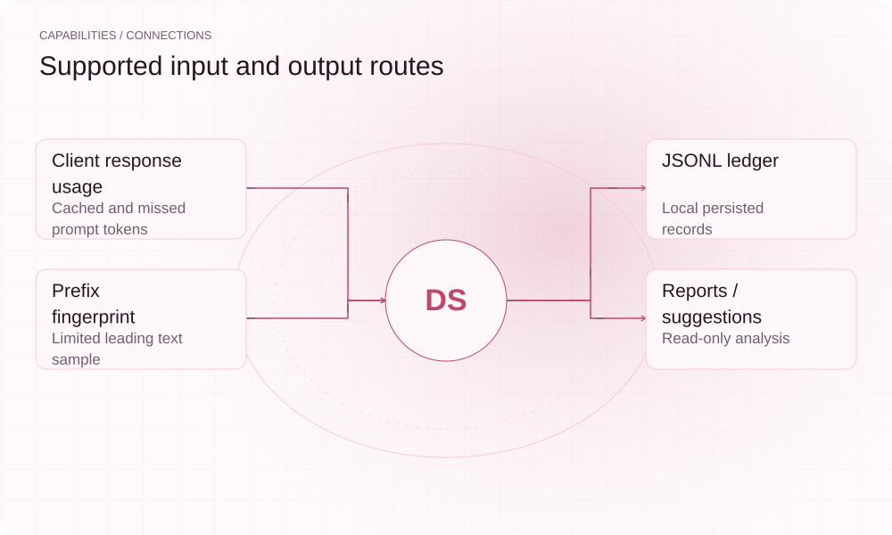

[English](./README.en.md) · [Website](https://dscache.lei6393.com) · [GitHub](https://github.com/SuperMarioYL/dscache)

<picture>
  <source media="(max-width: 600px) and (prefers-color-scheme: dark)" srcset="./assets/presentation/hero-mobile-dark.svg">
  <source media="(max-width: 600px)" srcset="./assets/presentation/hero-mobile-light.svg">
  <source media="(prefers-color-scheme: dark)" srcset="./assets/presentation/hero-dark.svg">
  
</picture>

# dscache

**逐请求查看缓存命中与未命中用量。**

dscache 包装兼容客户端以记录返回的 prompt-cache 用量，再把保存账本分类为 HIT、PARTIAL、MISS 或 UNKNOWN。

v0.9.0 修正了全 UNKNOWN 账本和没有前缀失效记录时的报告与建议，避免在缺少证据时生成确定的缓存损失结论。

## 为什么需要它

总 prompt 数量可能掩盖缓存输入占比变化。逐请求保留拆分，有助于调查回退，而不把每次未命中都归因于 prompt 编辑。

- **保留用量拆分** — 缓存与未缓存 prompt token 分别记录。
- **保留未知状态** — 缺失字段不会变成虚构缓存命中。
- **建议而不改写** — 重排分析不修改请求。

## 架构

<picture>
  <source media="(max-width: 600px) and (prefers-color-scheme: dark)" srcset="./assets/presentation/architecture-mobile-dark.svg">
  <source media="(max-width: 600px)" srcset="./assets/presentation/architecture-mobile-light.svg">
  <source media="(prefers-color-scheme: dark)" srcset="./assets/presentation/architecture-dark.svg">
  
</picture>

包装器在本地记录用量字段与前缀元数据。profile 计算档位和前缀指纹，再把前缀变化的未命中关联到前一参考。report 渲染账本，reorder 提供建议而不改写请求。

| 组件 | 职责 |
| --- | --- |
| `Compatible client` | src/dscache/wrapper.py |
| `Local ledger` | JSONL usage records |
| `Cache profiler` | src/dscache/profiler.py |
| `Report / suggestions` | report.py; reorder.py |

## 安装与快速上手

使用仓库清单指定的运行时版本构建，并在仓库根目录运行示例。

```bash
git clone https://github.com/SuperMarioYL/dscache.git
cd dscache
uv venv .venv
uv pip install --python .venv/bin/python -e .
source .venv/bin/activate
```

分析三条明确记录：高命中请求、相同前缀未命中、缺少缓存拆分的请求。

```bash
.venv/bin/python examples/presentation-demo.py
```

## 实际运行示例

<picture>
  <source media="(max-width: 600px) and (prefers-color-scheme: dark)" srcset="./assets/presentation/process-mobile-dark.svg">
  <source media="(max-width: 600px)" srcset="./assets/presentation/process-mobile-light.svg">
  <source media="(prefers-color-scheme: dark)" srcset="./assets/presentation/process-dark.svg">
  
</picture>

The three rows classify as HIT, MISS and UNKNOWN; the identical-prefix miss is not linked to a prefix mutation.

```text
{"request": "one", "tier": "HIT", "cached": 95, "miss": 5, "busted_against": null}
{"request": "two", "tier": "MISS", "cached": 5, "miss": 95, "busted_against": "one"}
{"request": "three", "tier": "UNKNOWN", "cached": null, "miss": null, "busted_against": null}
```

完整命令与输出保存在 [docs/demo-results.json](./docs/demo-results.json). 输入和复现代码均随仓提供。


保留已有录制供参考；上方文字示例给出当前可复现的操作。

## 用法

CLI 提供以下操作。示例之外的命令需要替换成你的文件路径或标识。

```bash
# Fake-client ledger example, no API key:
python examples/quickstart.py
dscache report
dscache suggest
dscache report --ledger .dscache/ledger.jsonl
```

## 配置

wrap(client) 将真实模型调用委托给已有客户端并写本地账本。--ledger/-l 指定报告输入，默认 .dscache/ledger.jsonl；缓存占比至少 90% 归为 HIT，至多 10% 归为 MISS。

## 集成与职责分工

<picture>
  <source media="(max-width: 600px) and (prefers-color-scheme: dark)" srcset="./assets/presentation/integrations-mobile-dark.svg">
  <source media="(max-width: 600px)" srcset="./assets/presentation/integrations-mobile-light.svg">
  <source media="(prefers-color-scheme: dark)" srcset="./assets/presentation/integrations-dark.svg">
  
</picture>

以下路径已有源码实现。按任务选择输入，并把生成的结果与项目一起保存。

| 路径 | 已实现职责 |
| --- | --- |
| Client response usage | Cached and missed prompt tokens |
| JSONL ledger | Local persisted records |
| Prefix fingerprint | Limited leading text sample |
| Reports / suggestions | Read-only analysis |

## 限制与后续方向

- 相同前缀也可能因服务器原因未命中，分析器不会将每次未命中都当作客户端变化证明。
- 价格计算使用仓库费率常量与全缓存反事实，是估计，不是当前账单或保证可追回的节省。
- UNKNOWN 表示缓存拆分字段缺失；前缀指纹只覆盖有限前导样本，不代表完整请求等价。

提供方用量兼容性与更丰富前缀归因需要有代表性的轨迹；托管团队面板是独立后续工作。

## 许可与贡献

许可见 [LICENSE](./LICENSE). 反馈问题时请提供最小输入、执行命令和实际输出。
